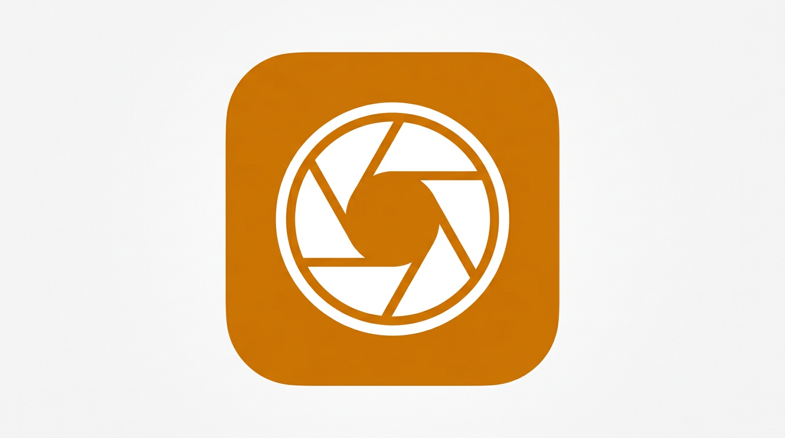

<p align="center">
  
</p>

<h1 align="center">SnapLog</h1>

<p align="center">
  A minimalist photo journal for capturing one moment a day.
</p>

<p align="center">
  <a href="https://github.com/TMHSDigital/Demo-Mobile-App/actions/workflows/ci.yml"></a>
  
  
  
  
</p>

<p align="center">
  <a href="https://github.com/TMHSDigital/Mobile-App-Developer-Tools"></a>
</p>

---

SnapLog is a local-first photo diary built with Expo and React Native. Take a photo, add a caption, and build a visual timeline of your life. Everything stays on your device -- no accounts, no cloud, no complexity. Optional AI-powered photo descriptions are available when an OpenAI API key is configured.

## What's New in 0.2.0

- **Settings persistence** -- reminder preferences now survive app restarts via SecureStore
- **Error recovery** -- graceful error UI when database initialization fails instead of hanging
- **Storage cleanup** -- photo files are deleted from disk when entries are removed
- **Photo sharing** -- share now sends the actual image instead of just text
- **Expo Go support** -- camera screen gracefully degrades with a clear message in Expo Go
- **Targeted notifications** -- daily reminder uses a specific identifier instead of cancelling all notifications
- **Responsive layout** -- journal grid adapts to screen size changes and split view
- **Stronger IDs** -- entry IDs use `expo-crypto` UUID instead of timestamp-based generation
- **CI improvements** -- lint job now runs `expo lint` instead of duplicating type-check
- **Plugin config** -- `expo-camera` and `expo-notifications` added to app.json plugins

## Features

- **Daily photo capture** with front/back camera and flash control
- **Journal feed** in a two-column masonry grid with pull-to-refresh
- **Entry detail view** with full photo, caption, date, and share
- **AI photo descriptions** via OpenAI Vision (optional, gated on env var)
- **Daily reminder notifications** with configurable time
- **Offline-first** with SQLite persistence -- works without network
- **Clean, warm UI** with a custom theme and smooth transitions

## Tech Stack

| Library | Why |
|---------|-----|
| **Expo SDK 54** | Managed workflow, fast iteration, cross-platform |
| **Expo Router** | File-based routing, deep linking out of the box |
| **Zustand** | Minimal state management, no boilerplate |
| **expo-sqlite** | Structured local storage, better than AsyncStorage for relational data |
| **expo-camera** | Native camera integration with the managed workflow |
| **expo-image** | Optimized image loading with caching and transitions |
| **expo-notifications** | Local push notifications for daily reminders |

## Getting Started

### Prerequisites

- Node.js 20+
- Expo CLI (`npx expo`)
- iOS Simulator (macOS) or Android Emulator, or Expo Go on a physical device
- For full native features (camera, notifications): a [development build](https://docs.expo.dev/develop/development-builds/introduction/) via `npx expo run:ios` or `npx expo run:android`

### Install and Run

```bash
git clone https://github.com/TMHSDigital/Demo-Mobile-App.git
cd Demo-Mobile-App
npm install
npx expo start
```

Scan the QR code with Expo Go, or press `i` for iOS Simulator / `a` for Android Emulator.

## Running on Your Device

1. Install [Expo Go](https://expo.dev/go) on your phone
2. Run `npx expo start` on your machine
3. Scan the QR code from the terminal output
4. For a development build with full native module access, run `npx expo run:ios` or `npx expo run:android`

## Optional: AI Photo Descriptions

SnapLog can generate short, journal-style descriptions of your photos using OpenAI Vision.

1. Copy `.env.example` to `.env`
2. Add your OpenAI API key:
   ```
   EXPO_PUBLIC_OPENAI_KEY=sk-...
   ```
3. Restart the dev server

An "AI Describe" button appears on the photo preview screen when the key is configured.

## Architecture

```
app/                    # Expo Router screens
  (tabs)/               # Bottom tab navigator
    index.tsx           # Journal feed (FlatList grid)
    camera.tsx          # Camera capture
    settings.tsx        # Settings with reminders + about
  entry/[id].tsx        # Entry detail view
components/             # Shared UI components
lib/                    # Business logic
  database.ts           # SQLite CRUD operations
  store.ts              # Zustand state management
  ai.ts                 # OpenAI Vision client
  notifications.ts      # Push notification helpers
  permissions.ts        # Permission request helpers
  types.ts              # TypeScript interfaces
constants/theme.ts      # Design tokens (colors, spacing, typography)
```

Data flows from the camera through `PhotoPreview` (which copies photos to the document directory and persists entries via the Zustand store backed by SQLite) into the journal feed. The store is the single source of truth, with SQLite as the persistence layer.

## Skills Used

This app was built using the [Mobile App Developer Tools](https://github.com/TMHSDigital/Mobile-App-Developer-Tools) Cursor plugin. It exercises 12 of the 20 skills:

| Skill | Where in the app |
|-------|-----------------|
| mobile-project-setup | Initial Expo scaffolding and configuration |
| mobile-navigation-setup | Tab and stack navigation with Expo Router |
| mobile-state-management | Zustand store with SQLite backing |
| mobile-component-patterns | EntryCard, PhotoPreview, EmptyState, IconButton |
| mobile-camera-integration | Camera capture screen with preview flow |
| mobile-ai-features | OpenAI Vision photo descriptions |
| mobile-permissions | Camera and media library permission handling |
| mobile-push-notifications | Daily reminder notifications |
| mobile-local-storage | SQLite database and SecureStore |
| mobile-app-store-prep | Store preparation guide in docs/ |
| mobile-accessibility | AccessibilityLabel on all interactive elements, proper touch targets |
| mobile-performance | FlatList with memo, no inline styles, LayoutAnimation |

## License

[MIT](LICENSE)
