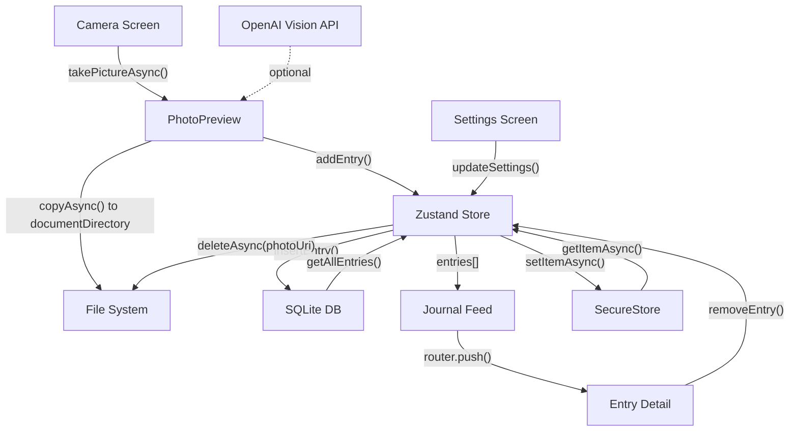

# Architecture

## Technology Decisions

### Expo Router over React Navigation

Expo Router provides file-based routing that mirrors how web apps work. Routes map directly to files in the `app/` directory, eliminating the boilerplate of manual route registration. Deep linking and URL-based navigation come free. React Navigation is still running under the hood, but the developer experience is significantly better for apps with straightforward navigation patterns.

### Zustand over Redux or Context

Redux adds too much ceremony for an app this size. React Context re-renders every consumer on any state change, which causes unnecessary work in list-heavy UIs. Zustand gives us a simple, typed store with selective subscriptions (components only re-render when the specific slice they read changes) and zero boilerplate. The store is ~40 lines including all actions.

### SQLite over AsyncStorage

AsyncStorage is a key-value store. Journal entries have structured fields (id, photoUri, caption, timestamps, optional AI description) that benefit from a relational schema. SQLite lets us query by date, paginate in the future, and perform partial updates without serializing the entire dataset. `expo-sqlite` uses the synchronous async API for clean await-based CRUD.

### expo-image over React Native Image

`expo-image` supports disk caching, progressive loading, transitions, and `contentFit` out of the box. The built-in `Image` component lacks caching and has no loading transitions, which makes photo-heavy apps feel sluggish.

## Data Flow

## Storage Schema

### `entries` table

| Column | Type | Constraints |
|--------|------|------------|
| id | TEXT | PRIMARY KEY |
| photoUri | TEXT | NOT NULL |
| caption | TEXT | NOT NULL, DEFAULT '' |
| aiDescription | TEXT | nullable |
| createdAt | TEXT | NOT NULL (ISO 8601) |

Photos are stored in the app's document directory at `{documentDirectory}photos/{id}.{ext}`. This ensures they persist across app restarts and aren't cleaned up by the OS cache purge. When an entry is deleted, its photo file is also removed from disk.

### Settings persistence

App settings (reminder toggle and time) are stored in `expo-secure-store` under the key `snaplog_settings`. Settings are loaded on app startup and written on every update.

## Future Enhancements

- **Authentication and cloud sync** via the `mobile-auth-setup` skill -- add Supabase or Firebase for cross-device sync
- **Multiple photos per entry** -- extend the schema with an `entry_photos` junction table
- **Search and filtering** -- full-text search on captions using SQLite FTS5
- **Export** -- generate a PDF or image collage of selected entries
